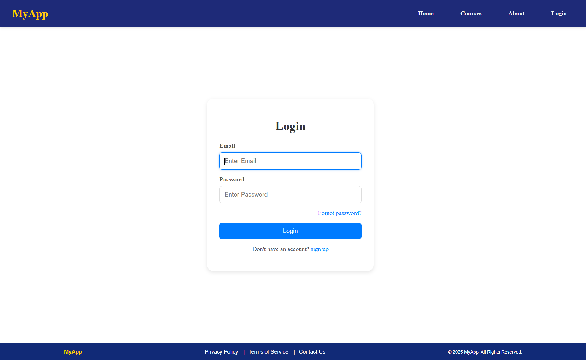
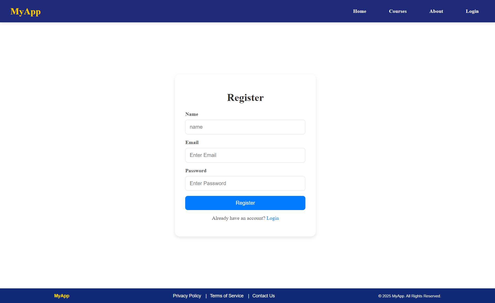
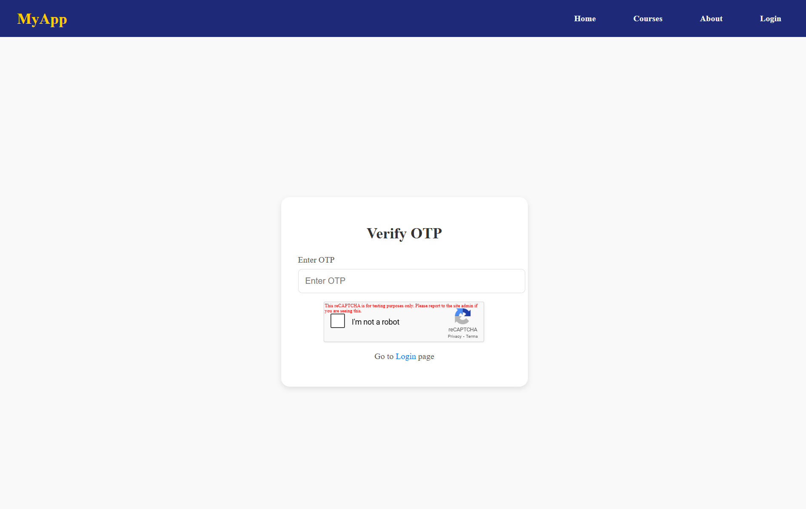
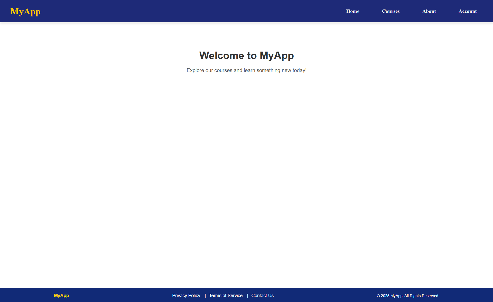
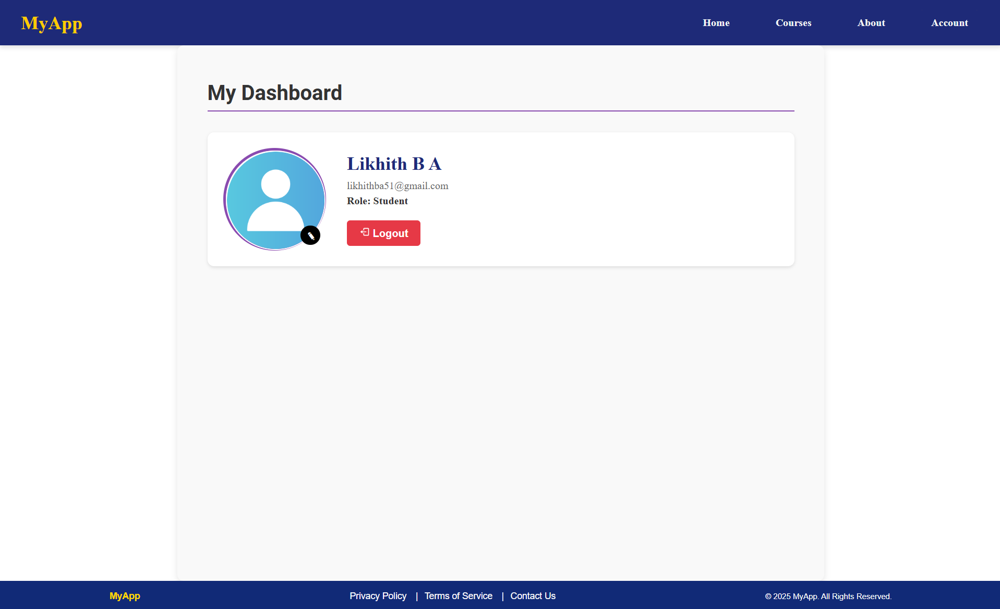
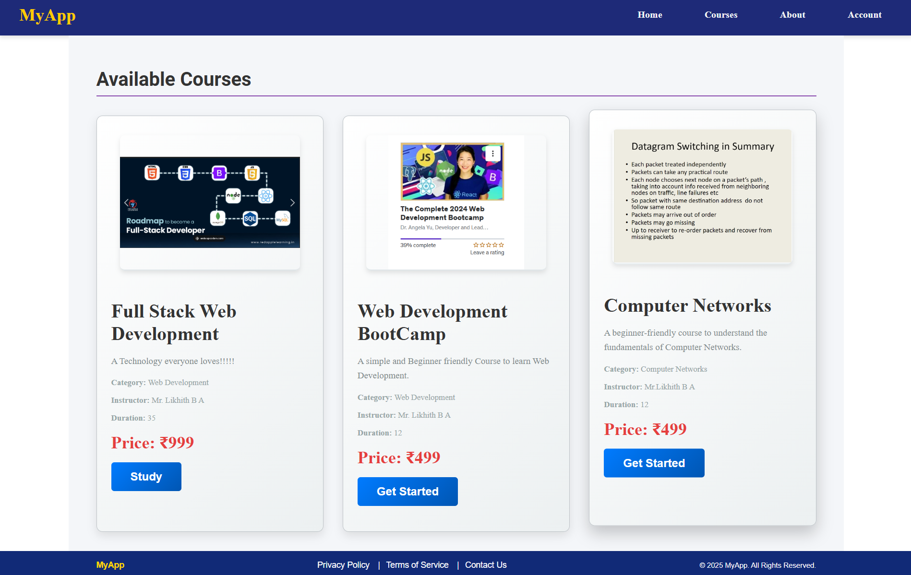
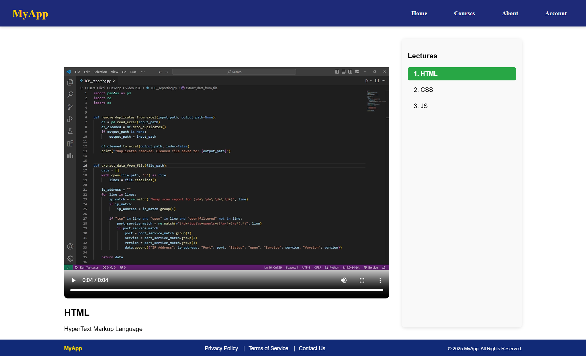
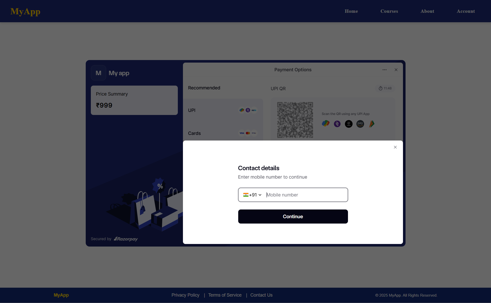

# E-Learning Platform

A full-featured **E-Learning Platform** built using the **MERN stack**, providing seamless user authentication, course management, and secure payment integration using Razorpay. The platform offers an intuitive and interactive learning experience with real-time progress tracking and notifications.

## 🚀 Features

- **User Authentication** - Secure login and registration using JWT & bcrypt.
- **Course Management** - Enroll in courses, track progress, and access video lectures.
- **Payment Integration** - Razorpay payment gateway for secure transactions.
- **Interactive Learning** - Real-time progress tracking and notifications.
- **ReCAPTCHA Integration** - Enhanced security with Google reCAPTCHA.
- **Email Notifications** - Automated email alerts using Nodemailer.
- **File Uploads** - Cloudinary integration for storing images and videos.

## 🛠 Tech Stack

### Frontend:
- **React.js** - For building the user interface.
- **React Router** - For client-side navigation.
- **React Hot Toast** - For user-friendly notifications.
- **React Google reCAPTCHA** - For bot protection.
- **Axios** - For making API requests.

### Backend:
- **Node.js & Express.js** - For handling server-side logic.
- **MongoDB & Mongoose** - Database for storing user and course details.
- **JWT & Bcrypt** - For authentication and security.
- **Multer** - For handling file uploads.
- **Cloudinary** - For cloud-based media storage.
- **Razorpay** - For secure online transactions.
- **Nodemailer** - For sending email notifications.

## 🔧 Installation & Setup

### 1️⃣ Clone the Repository
```sh
git clone https://github.com/likhith-b-a/EduSphere.git
cd EduSphere
```

### 2️⃣ Install Dependencies
#### Backend:
```sh
cd server
npm install
```

#### Frontend:
```sh
cd client
npm install
```

### 3️⃣ Set Up Environment Variables
Create a **.env** file in the root of the **server** and **client** directories with the following variables:

#### Backend (.env)
```env

PORT = 8000
MONGODB_URI=your_mongodb_connection_string
CORS_ORIGIN=*
Activation_Secret=your_activation_token_secret
PASSWORD=your_gmail_app_password
GMAIL=your_gmail
ACCESS_TOKEN_SECRET=your_access_token_secret
ACCESS_TOKEN_EXPIRY=1d
REFRESH_TOKEN_SECRET=your_refresh_token_secret
REFRESH_TOKEN_EXPIRY=10d
CLOUDINARY_CLOUD_NAME=your_cloudinary_cloud_name
CLOUDINARY_API_KEY=your_cloudinary_api_key
CLOUDINARY_API_SECRET=your_cloudinary_api_secret
Razorpay_key=your_razorpay_api_key
Razorpay_Secret=your_razorpay_api_secret
Forgot_Secret=your_forget_password_token_secret
frontend_url = http://localhost:5173/
```

#### Frontend (.env)
```env
VITE_BACKEND_URL=http://localhost:5000
VITE_RAZORPAY_KEY=your_razorpay_key
VITE_RECAPTCHA_SITE_KEY=your_recaptcha_key
```

### 4️⃣ Run the Application
#### Start Backend Server
```sh
cd server
npm start
```

#### Start Frontend
```sh
cd client
npm start
```

The application will be available at `http://localhost:5173`.

## 📸 Screenshots

Here are some screenshots of the platform:

- **Login Page**  
  

- **Register Page**  
  

- **OTP Verification Page**  
  


- **Home Page**  
  

- **Profile Page**  
  

- **Courses Page**  
  

- **Lectures Page**  
  

- **Payment Page**  
  

## 🤝 Contributing
Feel free to fork this repository and submit pull requests to improve the project.

---

**Happy Learning! 🎓🚀**


